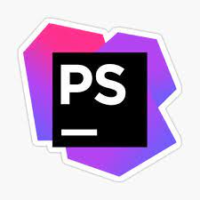
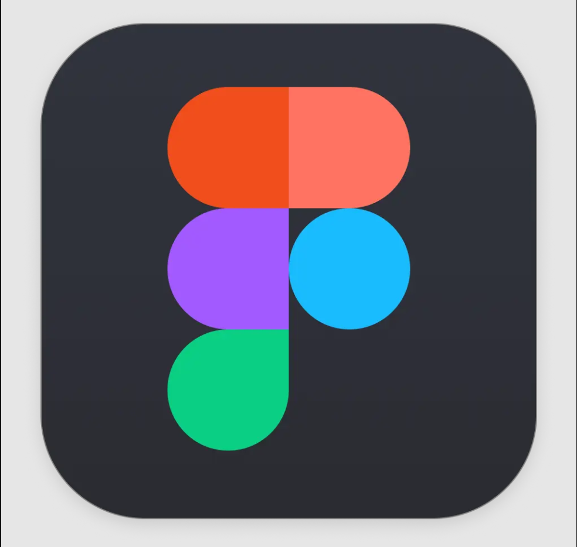

### Hi there 👋
### Im Dhanushka /  Web application developer

<h3> 
<i>
" A successful project requires professionals - 
the people who know how to tailor it " 
</i> 
</h3>

I have experience working in an agile environment and have also built SaaS applications for various startups. 
I have worked both independently and in teams as a remote frontend and backend developer

 Since 2019, I have actively utilized Laravel for: 

<ul>
        <li>Developing large enterprise applications </li>
        <li>Integrating payment gateways</li>
        <li>Creating e-commerce applications</li>
        <li>Designing and implementing APIs for mobile applications</li>
        <li>Setting up deployment servers from scratch on Ubuntu</li>
</ul>

 I have a deep understanding in the following areas: 

<ul>
        <li>Query Builder,</li>
        <li>Eloquent ORM,</li>
        <li>Relationships, and Polymorphism</li>
        <li>Service Container, Service Provider, Queue Jobs, and Facade</li>
        <li>Handling task scheduling</li>
        <li>Refactoring queries and optimizing memory usage</li>
        <li>Object-oriented programming ...</li>
        <li>SOLID principles ...</li>
        <li>Modular development as well as numbers, statistics and calculations: ...</li>
</ul>

<ul>
        <li>CSS BEM CONVENTION </li>
        <li>CSS 3 </li>
        <li>BOOTSTRAP 5 </li>
        <li>HTML 5</li>
        <li>JS DOM</li>
</ul>

**Languages,Frameworks and Tools**

<code></code>
<code></code>
<code></code>
<code></code>
<code></code>
<code></code>
<code></code>
<code></code>
<code></code>
<code></code>

