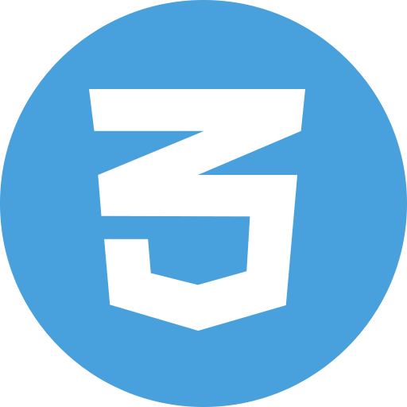
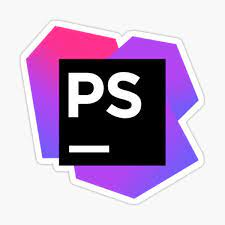
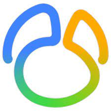
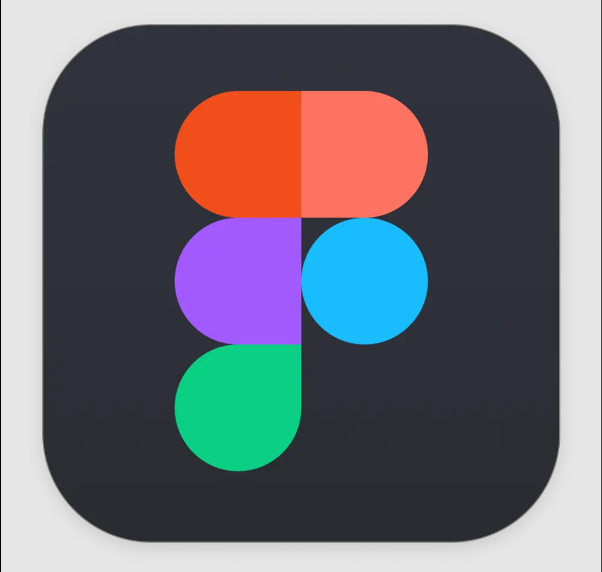

### Hi there 👋
### Im Dhanushka Gayan

 
- 🔭 ❤️ Algorithms ...
- 🌱 ❤️‍ Design patterns ...
- 👯 ❤️ Unit testing ...
- 🤔 ❤️‍ SOLID principles ...
- 📫 ❤️ Modular development as well as numbers, statistics and calculations: ...

**Languages and Tools**

<code></code>
<code></code>
<code></code>
<code></code>
<code></code>
<code></code>
<code></code>
<code></code>
<code></code>
<code></code>

