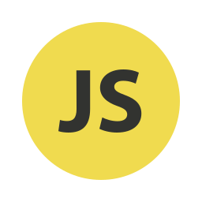

### Hi there 👋
### Im Dhanushka /  Web application developer

I have experience in developing projects using Scrum and Agile methodologies. I have also built SaaS applications for various startups and worked both independently and in teams as a remote front-end and back-end developer

- Object-oriented programming  ...
- SOLID principles ...
- Modular development as well as numbers, statistics and calculations: ...

**Languages,Frameworks and Tools**

<code></code>
<code></code>
<code></code>
<code></code>
<code></code>
<code></code>
<code></code>
<code></code>
<code></code>

