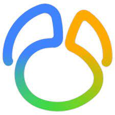

### Hi there 👋
### Im Dhanushka /  Web application developer

- Object-oriented programming  ...
- SOLID principles ...
- Modular development as well as numbers, statistics and calculations: ...

**Languages,Frameworks and Tools**

<code></code>
<code></code>
<code></code>
<code></code>
<code></code>
<code></code>
<code></code>
<code></code>
<code></code>

